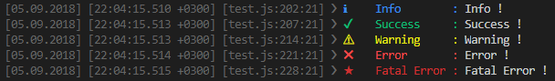
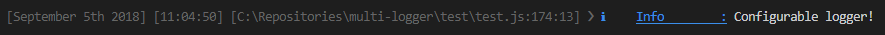
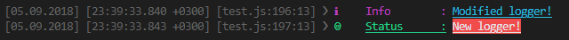
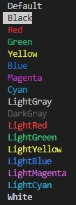
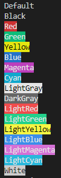

# multi-logger
A simple configurable multi level logger.

[](https://www.npmjs.com/package/multi-loggerjs)
[](https://npmcharts.com/compare/multi-loggerjs?minimal=true)
[](https://david-dm.org/NiyaziAki/multi-logger)
[](https://travis-ci.org/NiyaziAki/multi-logger)
[](https://codecov.io/gh/NiyaziAki/multi-logger)
[](https://codeclimate.com/github/NiyaziAki/multi-logger/maintainability)
[](https://github.com/NiyaziAki/multi-logger/blob/master/LICENSE)

[](https://nodei.co/npm/multi-loggerjs/)

## Install

```bash
npm i multi-loggerjs
```

## Usage

### Default Usage

```js
const logger = require("multi-loggerjs");

let multiLogger = new logger.MultiLogger();

multiLogger.info("Info !");
multiLogger.success("Success !");
multiLogger.warning("Warning !");
multiLogger.error("Error !");
multiLogger.fatal("Fatal Error !");
```
<div align="center">
  
</div>

### Configuration

```js
const logger = require("multi-loggerjs");

const options = {
  dateFormat: "MMMM Do YYYY",
  timeFormat: "h:mm:ss",
  showFullPath: true,
  showDate: true,
  showTime: true,
  showExternalCallerInfo: true
};

let multiLogger = new logger.MultiLogger(options);
multiLogger.info("Configurable logger!");

```
<div align="center">
  
</div>

multi-logger is using [](https://momentjs.com/docs/#/parsing/string-format/) for date and time formats.

#### Custom Loggers & Modifications

```js
const logger = require("multi-loggerjs");
const foregrounds = logger.foregrounds;
const backgrounds = logger.backgrounds;
const levels = logger.levels;

const options = {
  loggers: {
    info: {
      badge: "ℹ",
      foreground: foregrounds.Magenta,
      background: backgrounds.Default,
      isUnderlined: false,
      text: {
        foreground: foregrounds.LightCyan,
        background: backgrounds.Default,
        isUnderlined: true
      },
      label: "Info",
      level: levels.Trace
    },
    status: {
      level: levels.Trace,
      badge: "☺",
      label: "Status",
      foreground: foregrounds.LightGreen,
      background: backgrounds.Default,
      isUnderlined: true,
      text: {
        foreground: foregrounds.White,
        background: backgrounds.LightRed,
        isUnderlined: true
      }
    }
  }
};

let multiLogger = new logger.MultiLogger(options);
multiLogger.info("Modified logger!");
multiLogger.status("New logger!");

```

<div align="center">
  
</div>

#### Available Foregrounds and Backgrounds

Available foregrounds and backgrounds are as follows; Default, Black, Red, Green, Yellow, Blue, Magenta, Cyan, LightGray, DarkGray, LightRed, LightGreen, LightYellow, LightBlue, LightMagenta, LightCyan, White.

| Foregrounds   | Backgrounds   |
| ------------- |:-------------:|
|       |  |

#### Log Levels

Available log levels are as follows;
* Trace: 0
* Debug: 1
* Information: 2
* Warning: 3
* Error: 4
* Fatal: 5

#### Logging Rules

Each logger can write to different sources according to the environment defined configuration. By default the loggers use console for production and development with log level Trace. Each environment can use multiple sources for logging.


```js
const logger = require("multi-loggerjs");

const options = {
  rules: {
    production: {
      writeTo: {
        file: [
          {
            level: levels.Error,
            folderPath: "C:\\Repositories\\multi-logger\\test\\logs",
            fileName: "error.txt",
            size: 1024
          },
          {
            minLevel: levels.Warning,
            folderPath: "C:\\Repositories\\multi-logger\\test\\logs",
            fileName: "warning.txt",
            size: 1024
          }
        ],
        mongoDb: [{ minLevel: levels.Warning, connectionString: "mongodb://localhost:27017/multi-logger-demo" }]
      }
    },
    development: {
      writeTo: { console: [{ minLevel: levels.Trace }] }
    }
  }
};

const multiLogger = new logger.MultiLogger(options);
multiLogger.info("Writes to file and mongo db for production & console for development according to loggers log level!");
```

#### Logging Rules Attributes
* `level` - Single log level for the matching rule.
* `minLevel` - Minimal log level for the matching rule.
* `folderPath` - Folder path for the matching rule (Applies only if the rule is "file").
* `fileName` - File name for the matching rule (Applies only if the rule is "file").
* `size` - Maximum file size in bayts for the matching rule. Creates a new file if the maximum size is reached (Applies only if the rule is "file").
* `connectionString` - The connection string needed for the matching rule (Applies only if the rule is "mongoDb").

If level and minLevel is defined for the same rule minLevel will be taking to account.
